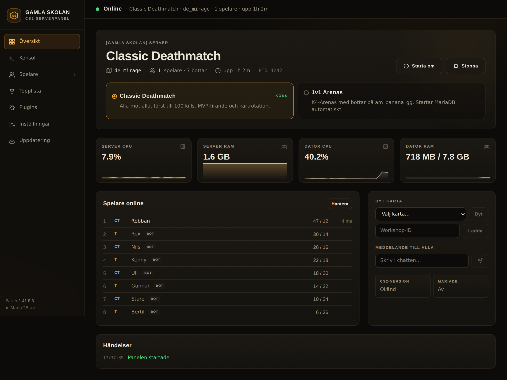

# [Gamla Skolan] CS2 – GUI-serverpanel och plugins

Allt som driver Gamla Skolans egen Counter-Strike 2-server: en serverpanel som körs som
program på Windows, och ett gäng egna CounterStrikeSharp-plugins för tre spellägen –
**Classic Deathmatch**, **Retakes** och **1v1 Arenas** – som spelarna kan rösta mellan i spelet.

> **⬇ [Ladda ner senaste versionen](https://github.com/YouTubeRobski87/CS2-GUI-serverpanel-och-plugins/releases/latest)** ·
> **[Kom igång (svenska)](docs/KOM-IGANG.md)** · **[Getting started (English)](docs/GETTING-STARTED.md)**



> Bilderna är tagna med testdata, inte från den riktiga servern.

### In English

A Windows GUI control panel and a set of CounterStrikeSharp plugins for a CS2 community
server running three game modes – **Deathmatch**, **Retakes** and **1v1 Arenas**.
The panel and the in-game messages are available in **English and Swedish**.

**→ [Download the latest release](https://github.com/YouTubeRobski87/CS2-GUI-serverpanel-och-plugins/releases/latest) and follow the [Getting started guide](docs/GETTING-STARTED.md).**

- **Panel** (SvelteKit + Node, runs as a desktop app with a tray icon): start/stop the
  server, switch modes, live players and stats, kick/slay/team/ban, map change, plugin
  management, chat tips editor and one-click CS2 updates via SteamCMD.
- **No RCON**: the panel talks to the server through a small file bridge plugin
  (`status.json` + command/result files), because CS2 RCON is unreliable and stalls the server.
- **In-game mode vote** (`!mode`): players vote for another mode and the panel restarts
  the server in it.
- **Retakes extras**: weapon menu (`!guns`) navigated with W/S/E, instadefuse, clutch
  announcements.
- **Setup check, GSLT token, server name, chat tag and editable game modes** – all from the
  Settings page, no config files to hand-edit.

The rest of this README is in Swedish – the [architecture diagram](#hur-det-hänger-ihop)
and the tables should be readable either way. Licensed under MIT.

---

## Innehåll

- [Hur det hänger ihop](#hur-det-hänger-ihop)
- [Mappstruktur](#mappstruktur)
- [Serverpanelen](#serverpanelen)
- [Filbryggan (i stället för RCON)](#filbryggan-i-stället-för-rcon)
- [Spellägen och lägesbyte](#spellägen-och-lägesbyte)
- [Egna plugins](#egna-plugins)
- [Tredjepartsplugins](#tredjepartsplugins)
- [Installation](#installation)
- [Bygga från källkod](#bygga-från-källkod)
- [Hemligheter](#hemligheter)
- [Felsökning](#felsökning)

---

## Hur det hänger ihop

```
 ┌─────────────────────────── Windows-datorn ───────────────────────────┐
 │                                                                       │
 │  Gamla Skolan Panel (genväg)                                          │
 │     └─ launcher/panel-tray.ps1  ── ikon vid klockan, notiser          │
 │          ├─ startar  node build  (panelen, osynligt, port 8027)       │
 │          └─ öppnar   Chrome --app=http://localhost:8027  (eget fönster)│
 │                                                                       │
 │  Panelen (SvelteKit + Node)                                           │
 │     ├─ startar/stoppar cs2.exe, byter läge (flyttar plugin-mappar)    │
 │     ├─ uppdaterar CS2 via SteamCMD                                    │
 │     └─ pratar med servern via filer ──────────────┐                   │
 │                                                   ▼                   │
 │  CS2 dedicated server (cs2.exe)        counterstrikesharp/data/gs_panel│
 │     └─ Metamod + CounterStrikeSharp      ├─ status.json   (varje sek) │
 │          ├─ GamlaSkolanPanelBridge  ◄────┼─ commands/*.json           │
 │          ├─ GamlaSkolanLage  ────────────┼─ requests/mode.json        │
 │          ├─ GamlaSkolanVapen, Rank, Ads, │   (röstat lägesbyte)       │
 │          │  Mvp …                        └─ results/*.json            │
 │          └─ Retakes / Deathmatch / K4-Arenas (beroende på läge)       │
 └───────────────────────────────────────────────────────────────────────┘
```

**Kort:** panelen styr servern utifrån (processen, lägen, uppdateringar), och pratar med
den inifrån via en filbrygga som ett eget plugin läser och skriver. Ingen RCON behövs.

---

## Mappstruktur

| Mapp | Innehåll |
|---|---|
| `panel/` | Serverpanelen – SvelteKit 2, Svelte 5, Tailwind 4, adapter-node |
| `panel/src/lib/server/` | Allt som körs i Node: start/stopp, lägen, bryggan, loggar, uppdatering |
| `panel/src/lib/components/` | Flikarna i gränssnittet (Översikt, Konsol, Spelare, Topplista, Plugins, Inställningar, Uppdatering) |
| `launcher/` | Startprogrammet: ikon vid klockan, eget fönster, genvägar |
| `plugins/` | Egna CounterStrikeSharp-plugins (C#, .NET 10) |
| `server-config/` | Configfiler som pluginen behöver (retakes-inställningar, svenska översättningar) |
| `docs/bilder/` | Skärmbilder |

På servern ligger det så här (standardsökvägar, kan ändras i panelens Inställningar):

```
C:\GameServers\
├─ CS2\                         CS2 dedicated server (SteamCMD, app 730)
│  ├─ game\csgo\addons\counterstrikesharp\
│  │  ├─ plugins\               aktiva plugins
│  │  ├─ shared\                delade bibliotek (RetakesPluginShared, DeathmatchAPI)
│  │  ├─ configs\plugins\       pluginens inställningar (JSON)
│  │  └─ data\gs_panel\         filbryggan
│  └─ _panel_disabled\          avstängda plugins för de lägen som inte körs
├─ GamlaSkolanPanel\            panelen (build\, panel-data\, panel-tray.ps1 …)
└─ GamlaSkolan*-source\         källkod för pluginen
```

---

## Serverpanelen

Panelen är en SvelteKit-app som byggs till en fristående Node-server (`node build`) och
bara lyssnar på `127.0.0.1:8027`. Alla anrop från andra adresser än localhost nekas
(`hooks.server.js`).

### Flikar

| Flik | Vad den gör |
|---|---|
| **Översikt** | Starta/stoppa/starta om, välj läge, CPU/RAM-grafer, spelare online, byt karta, meddelande till alla, händelselogg |
| **Konsol** | Spellogg och pluginlogg live, skicka serverkommandon. `status` och `css_plugins list` besvaras från bryggan, cvar-kommandon svarar med nya värdet |
| **Spelare** | Lag, K/D, ping, MVP. Byt lag, slay, kick, ban |
| **Topplista** | Från GamlaSkolanRank |
| **Plugins** | Lista med version och status. Ladda, ladda om och ladda ur |
| **Inställningar** | Servernamn, chattips (med förhandsvisning av färger), MVP, Rank, sökvägar |
| **Uppdatering** | Jämför installerad version med Steam och uppdaterar via SteamCMD. Lägger tillbaka Metamod-raden i `gameinfo.gi` efteråt |

### Viktiga filer i `panel/src/lib/server/`

| Fil | Ansvar |
|---|---|
| `server.js` | Hittar `cs2.exe` via PowerShell var 3:e sekund, start/stopp, lägesbyte, Metamod-fix, lyssnar på röstade lägesbyten |
| `settings.js` | Panelens inställningar (`panel-data/settings.json`), lägesdefinitioner, läser GSLT-token |
| `bridge.js` | Filbryggan till servern |
| `game.js` | Spelare, plugins, topplista, redigerbara plugin-inställningar, kartbyte |
| `logs.js` | Läser spellogg och pluginlogg som en levande konsol |
| `update.js` | Versionskoll mot Steam och uppdatering via SteamCMD |
| `rcon.js` | Reserv om bryggan inte är igång (används i praktiken inte) |
| `events.js` | Händelseloggen i Översikt |

### Startprogrammet (`launcher/`)

- **`panel-tray.ps1`** – startar panelen osynligt, öppnar den i Chrome/Edge i app-läge
  (eget fönster, egen profil i `panel-data\fonster`), lägger en ikon vid klockan med
  *Öppna / Starta om / Avsluta*, visar serverns status i tooltip och notiser när servern
  startar eller stängs. Skapar också genvägar på skrivbordet och i Start-menyn.
  Loggar till `panel-data\tray.log`.
- **`Gamla Skolan Panel.vbs`** – alternativ start utan konsolfönster.
- **`Starta panelen.bat`** – gamla sättet: panelen i ett cmd-fönster.

---

## Filbryggan (i stället för RCON)

RCON i CS2 tappar svar och fick servern att frysa flera sekunder per kommando. Därför
pratar panelen med servern via filer i `counterstrikesharp/data/gs_panel/`:

| Fil | Riktning | Innehåll |
|---|---|---|
| `status.json` | server → panel | Karta, läge, spelare med statistik, laddade plugins. Skrivs varje sekund |
| `commands/<id>.json` | panel → server | `exec`, `say`, `kick`, `team`, `slay`, `plugin` (load/unload/reload) |
| `results/<id>.json` | server → panel | `{ ok, msg }` – svar på kommandot |
| `requests/mode.json` | server → panel | Lägesbyte som spelarna röstat fram |

Bryggan läser kommandon 4 gånger per sekund och kör dem på spelets huvudtråd.
CS2 låter inte plugins läsa serverkonsolen, så vanliga kommandon svarar `Kört` eller
cvarens nya värde.

---

## Spellägen och lägesbyte

| Läge | Plugins som slås på | Startargument |
|---|---|---|
| **Classic Deathmatch** | Deathmatch, DeathmatchAPI, GamlaSkolanMvp | `game_type 1, game_mode 2`, `gamla_dm_classic.cfg` |
| **1v1 Arenas** | K4-Arenas, K4-Arenas-Bots (+ MariaDB) | `arena_boot.cfg` → Workshop-kartan am_banana_gg |
| **Retakes** | RetakesPlugin, GamlaSkolanVapen, Instadefuse, ClutchAnnounce | `game_type 0, game_mode 1`, de_mirage |

Ett lägesbyte flyttar plugin-mappar mellan `plugins/` och `_panel_disabled/` och startar
servern med lägets argument. Lägena definieras i `panel/src/lib/server/settings.js`
och sparas i `panel-data/settings.json`. Nya plugins i standardlägena läggs till
automatiskt när panelen uppdateras.

**Röstning i spelet:** `!lage` (eller automatiskt vid matchslut) → spelarna röstar med
W/S/E → vinner ett annat läge skriver GamlaSkolanLage `requests/mode.json` → panelen
startar om servern i det läget. Spelarna får återansluta via Senaste/Favoriter.

---

## Egna plugins

Alla ligger i `plugins/` och byggs mot serverns egen CounterStrikeSharp (API 375+).

| Plugin | Vad den gör | Kommandon |
|---|---|---|
| **GamlaSkolanPanelBridge** | Filbryggan mot panelen (se ovan) | – |
| **GamlaSkolanLage** | Omröstning om spelläge, sätter servernamnet vid varje kartstart | `!lage`, `!mode` |
| **GamlaSkolanVapen** | Vapenval för Retakes: T-/CT-gevär, AWP (max 1 per lag), sidovapen, pistolrundor. Meny med W/S/E/A/R. Sparas per spelare | `!vapen`, `!guns`, `!gun` |
| **GamlaSkolanArenaBots** | I 1v1 Arenas: tar ifrån bottarna kniven när de har ett vapen, så de inte springer runt med kniv (påverkar inte knivrundor eller riktiga spelare) | – |
| **GamlaSkolanZombieMenu** | Adminmeny för Zombie-läget: rundtid, HP, knockback, blödning m.m. Sparar i ZombieMode.json och kan be panelen starta om servern | `!zm`, `!zombie` |
| **GamlaSkolanRank** | Poäng per kill/död, räknas även i deathmatch (bottar halva poängen) | `!rank`, `!top` |
| **GamlaSkolanMvp** | Först till X kills: fryser alla, MVP-banner, byter karta från kartlistan | – |
| **GamlaSkolanAds** | Chattips på svenska med färger, redigeras i panelen | – |

### Pluginens inställningar

Finns i `counterstrikesharp/configs/plugins/<Plugin>/<Plugin>.json` och de flesta kan
ändras direkt i panelens **Inställningar** (pluginet laddas om när du sparar).

---

## Tredjepartsplugins

Används men ingår inte i repot (egna licenser). Byggs mot samma CounterStrikeSharp.

| Plugin | Källa | Ändringar för Gamla Skolan |
|---|---|---|
| Metamod:Source + CounterStrikeSharp | sourcemm.net, roflmuffin/CounterStrikeSharp | – |
| AdminPlus | – | – |
| Deathmatch (NockyCZ-fork) | – | – |
| K4-Arenas + Bots | – | – |
| QuakeSounds | – | – |
| MultiAddonManager | – | Extra addon 3461824328 |
| **RetakesPlugin** 3.1.1 | B3none/cs2-retakes | Svensk översättning som standard (`server-config/lang`), egen `retakes.cfg` med bottar |
| **Instadefuse** | B3none/cs2-instadefuse | Svenska texter |
| **Clutch Announce** | B3none/cs2-clutch-announce | Svenska texter, räknar 1v2 i stället för minst 1v3 (`MinPlayers = 2`) |
| **Zombie Mode** (cs2-zombie-mode) | nvmxre/cs2-zombie-mode | Svensk översättning (`server-config/lang/ZombieMode/sv.json`), eget läge "Zombie" i panelen och omröstningen |

---

## Installation

Steg för steg finns i **[Kom igång](docs/KOM-IGANG.md)** ([English](docs/GETTING-STARTED.md)).
Kort: installera CS2-servern, Metamod och CounterStrikeSharp, packa upp release-zippen
(`ServerFiles` till servern, `Panel` var du vill), starta `Gamla Skolan Panel.vbs` och fyll i
**Inställningar → Kom igång** (servermapp och GSLT-token).

Release-zippen innehåller:

| Mapp | Innehåll |
|---|---|
| `Panel/` | färdigbyggd panel (`build/`), startprogrammet och ikonen |
| `ServerFiles/game/csgo/addons/counterstrikesharp/plugins/` | alla egna plugins, färdigbyggda |
| `Optional/` | `retakes.cfg` med bottar och svenska språkfiler till Retakes-pluginen |

---

## Bygga från källkod

**Panelen**

```bash
cd panel
npm ci
npm run build        # → panel/build
```

**Plugins** (.NET 10 SDK)

```bash
cd plugins/GamlaSkolanVapen
dotnet build -c Release -p:CssDir="C:\GameServers\CS2\game\csgo\addons\counterstrikesharp"
```

`CssDir` pekar på serverns CounterStrikeSharp-mapp; standardvärdet står i
`plugins/Directory.Build.props`. GamlaSkolanVapen behöver även
`shared\RetakesPluginShared\RetakesPluginShared.dll` från RetakesPlugin.

**Testa panelen utan server**

```bash
GSP_DEMO=1 GSP_ROOT=/sökväg/till/testmapp GSP_DATA=./panel-data node build
```

`GSP_DEMO` låtsas att servern kör, så gränssnittet kan provas på vilken dator som helst.

---

## Hemligheter

Inga lösenord eller tokens finns i repot.

- **GSLT-token** läggs in under **Inställningar → Kom igång** och sparas i
  `panel-data\gslt.txt` på den egna datorn (visas maskerad i panelen). Filen ligger utanför repot.
- **`rcon_password`** läses ur serverns `server.cfg` om RCON-reserven används.
- `panel-data/`, `build/` och `node_modules/` är undantagna i `.gitignore`.

---

## Felsökning

| Problem | Lösning |
|---|---|
| Panelen säger att bryggan inte är igång | Starta om servern från panelen så laddas GamlaSkolanPanelBridge |
| 1v1 Arenas: `NO_MAP` / "appID ogiltigt" | Workshop-kartan saknas på disk men Steam tror att den finns. Rensa posten för 3170327415 i `game\bin\win64\steamapps\workshop\appworkshop_730.acf` med servern avstängd |
| Klienten är inaktuell | Fliken **Uppdatering** → Uppdatera |
| Plugin syns två gånger i Plugins-fliken | En gammal version ligger kvar i minnet efter omladdning – försvinner vid nästa serveromstart |
| Genvägen gör inget | Kör `Gamla Skolan Panel.vbs` en gång, då skapar programmet nya genvägar. Se `panel-data\tray.log` |
| Timeout när någon ansluter | Oftast på spelarens sida (krasch/avbruten laddning). Om ingen kan ansluta: kolla serverns port (standard 27015) i router/brandvägg |

---

## Licens

Egen kod i det här repot: [MIT](LICENSE). Tredjepartsplugins har sina egna licenser och ingår inte här.
